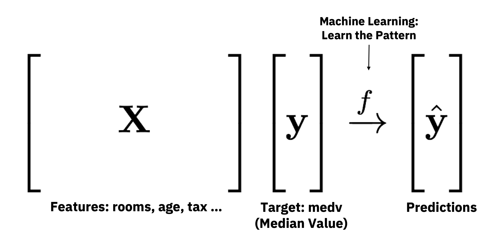
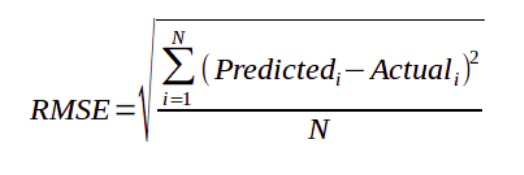
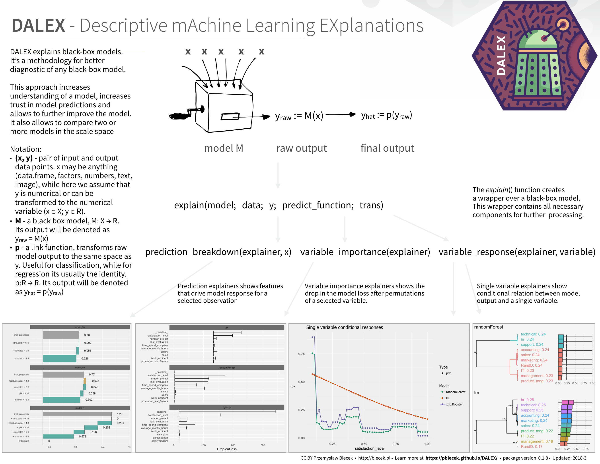

```{r knitr_init, echo=FALSE, cache=FALSE}
library(knitr)
library(rmdformats)
library(DT)

## Global options
options(max.print="75")
opts_chunk$set(echo=TRUE,
	             cache=FALSE,
               prompt=FALSE,
               tidy=TRUE,
               comment=NA,
               message=FALSE,
               warning=FALSE)
opts_knit$set(width=75)
```

# Agenda

- 09:00 to 09:30 Set Up & Introduction
- 09:30 to 10:30 Regression Example
- 10:30 to 11:00 Coffee Break
- 11:00 to 11:30 Classification Example
- 11:30 to 12:30 Bring Your Own Data + Q&A


# Set Up

## Download -> bit.ly/useR2019_h2o_tutorial

- `setup.R`: install packages required
- `tutorial.Rmd`: the main RMarkdown file with code 
- `tutorial.html`: this webpage
- Full URL https://github.com/woobe/useR2019_h2o_tutorial (if `bit.ly` doesn't work)


## R Packages

- Check out `setup.R`
- For this tutorial:
    - `h2o` for machine learning
    - `mlbench` for Boston Housing dataset
    - `DALEX`, `breakDown` & `pdp` for explaining model predictions
- For RMarkdown
    - `knitr` for rendering this RMarkdown
    - `rmdformats` for `readthedown` RMarkdown template
    - `DT` for nice tables


# Introduction

General Data Protection Regulation (GDPR) is now in place. Are you ready to explain your models? This is a hands-on tutorial for R beginners. I will demonstrate the use of H2O and other R packages for automatic and interpretable machine learning. Participants will be able to follow and build regression and classification models quickly with H2O's AutoML. They will then be able to explain the model outcomes with various methods.

It is a workshop for R beginners and anyone interested in machine learning. RMarkdown and the rendered HTML will be provided so everyone can follow without running the code.

(Now go to slides ...)


# Regression Part One: H2O AutoML

```{r, message=FALSE}
# Let's go
library(h2o) # for H2O Machine Learning
library(mlbench) # for Datasets
```

```{r}
# Enter your lucky seed here ...
n_seed <- 12345
```

## Data - Boston Housing from `mlbench`

```{r}
data("BostonHousing")
datatable(head(BostonHousing), 
          rownames = FALSE, options = list(pageLength = 6, scrollX = TRUE))
```

**Source**: UCI Machine Learning Repository [Link](https://archive.ics.uci.edu/ml/machine-learning-databases/housing/)

- **crim**: per capita crime rate by town.
- **zn**: proportion of residential land zoned for lots over 25,000 sq.ft.
- **indus**: proportion of non-retail business acres per town.
- **chas**: Charles River dummy variable (= 1 if tract bounds river; 0 otherwise).
- **nox**: nitrogen oxides concentration (parts per 10 million).
- **rm**: average number of rooms per dwelling.
- **age**: proportion of owner-occupied units built prior to 1940.
- **dis**: weighted mean of distances to five Boston employment centres.
- **rad**: index of accessibility to radial highways.
- **tax**: full-value property-tax rate per $10,000.
- **ptratio**: pupil-teacher ratio by town.
- **b**: 1000(Bk - 0.63)^2 where Bk is the proportion of people of African American descent by town.
- **lstat**: lower status of the population (percent).
- **medv** (This is the **TARGET**): median value of owner-occupied homes in $1000s.


## Define Target and Features

```{r}
target <- "medv" # Median House Value
features <- setdiff(colnames(BostonHousing), target)
print(features)
```

<center>

</center>

## Start a local H2O Cluster (JVM)

```{r}
h2o.init()
```

```{r}
h2o.no_progress() # disable progress bar for RMarkdown
h2o.removeAll()   # Optional: remove anything from previous session 
```


## Convert R dataframe into H2O dataframe

```{r}
# H2O dataframe
h_boston <- as.h2o(BostonHousing)
```


## Split Data into Train/Test

```{r}
h_split <- h2o.splitFrame(h_boston, ratios = 0.8, seed = n_seed)
h_train <- h_split[[1]] # 80% for modelling
h_test <- h_split[[2]] # 20% for evaluation
```

```{r}
dim(h_train)
dim(h_test)
```

## Cross-Validation

<center>

</center>


## Baseline Models

- `h2o.glm()`: H2O Generalized Linear Model
- `h2o.randomForest()`: H2O Random Forest Model
- `h2o.gbm()`: H2O Gradient Boosting Model
- `h2o.deeplearning()`: H2O Deep Neural Network Model 
- `h2o.xgboost()`: H2O wrapper for eXtreme Gradient Boosting Model from DMLC

### Baseline Generalized Linear Model (GLM)

```{r}
model_glm <- h2o.glm(x = features,               # All 13 features
                     y = target,                 # medv (median value of owner-occupied homes in $1000s)
                     training_frame = h_train,   # H2O dataframe with training data
                     model_id = "baseline_glm",  # Give the model a name
                     nfolds = 5,                 # Using 5-fold CV
                     seed = n_seed)              # Your lucky seed
```

```{r}
# Cross-Validation
model_glm@model$cross_validation_metrics
```


```{r}
# Evaluate performance on test
h2o.performance(model_glm, newdata = h_test)
```

Let's use RMSE

<center>

</center>


### Build Other Baseline Models (DRF, GBM, DNN & XGB)

```{r}
# Baseline Distributed Random Forest (DRF)
model_drf <- h2o.randomForest(x = features,
                              y = target,
                              training_frame = h_train,
                              model_id = "baseline_drf",
                              nfolds = 5,
                              seed = n_seed)
```

```{r}
# Baseline Gradient Boosting Model (GBM)
model_gbm <- h2o.gbm(x = features,
                     y = target,
                     training_frame = h_train,
                     model_id = "baseline_gbm",
                     nfolds = 5,
                     seed = n_seed)
```

```{r}
# Baseline Deep Nerual Network (DNN)
# By default, DNN is not reproducible with multi-core. You may get slightly different results here.
# You can enable the `reproducible` option but it will run on a single core (very slow).
model_dnn <- h2o.deeplearning(x = features, 
                              y = target, 
                              training_frame = h_train,
                              model_id = "baseline_dnn", 
                              nfolds = 5, 
                              seed = n_seed)
```

```{r}
# Baseline eXtreme Gradient Boosting Model (XGBoost)
model_xgb <- h2o.xgboost(x = features, 
                         y = target, 
                         training_frame = h_train,
                         model_id = "baseline_xgb", 
                         nfolds = 5, 
                         seed = n_seed)
```

### Comparison (RMSE: Lower = Better)

```{r}
# Create a table to compare RMSE from different models
d_eval <- data.frame(model = c("H2O GLM: Generalized Linear Model (Baseline)", 
                               "H2O DRF: Distributed Random Forest (Baseline)",
                               "H2O GBM: Gradient Boosting Model (Baseline)",
                               "H2O DNN: Deep Neural Network (Baseline)",
                               "XGBoost: eXtreme Gradient Boosting Model (Baseline)"),
                     stringsAsFactors = FALSE)
d_eval$RMSE_cv <- NA
d_eval$RMSE_test <- NA
```

```{r}
# Store RMSE values
d_eval[1, ]$RMSE_cv <- model_glm@model$cross_validation_metrics@metrics$RMSE
d_eval[2, ]$RMSE_cv <- model_drf@model$cross_validation_metrics@metrics$RMSE
d_eval[3, ]$RMSE_cv <- model_gbm@model$cross_validation_metrics@metrics$RMSE
d_eval[4, ]$RMSE_cv <- model_dnn@model$cross_validation_metrics@metrics$RMSE
d_eval[5, ]$RMSE_cv <- model_xgb@model$cross_validation_metrics@metrics$RMSE

d_eval[1, ]$RMSE_test <- h2o.rmse(h2o.performance(model_glm, newdata = h_test))
d_eval[2, ]$RMSE_test <- h2o.rmse(h2o.performance(model_drf, newdata = h_test))
d_eval[3, ]$RMSE_test <- h2o.rmse(h2o.performance(model_gbm, newdata = h_test))
d_eval[4, ]$RMSE_test <- h2o.rmse(h2o.performance(model_dnn, newdata = h_test))
d_eval[5, ]$RMSE_test <- h2o.rmse(h2o.performance(model_xgb, newdata = h_test))
```

```{r}
# Show Comparison (RMSE: Lower = Better)
datatable(d_eval, rownames = FALSE, options = list(pageLength = 10, scrollX = TRUE, round)) %>%
  formatRound(columns = -1, digits = 4)
```


## Manual Tuning

### Check out the hyper-parameters for each algo

```{r, eval=FALSE}
?h2o.glm 
?h2o.randomForest
?h2o.gbm
?h2o.deeplearning
?h2o.xgboost
```

### Train a xgboost model with manual settings

```{r}
model_xgb_m <- h2o.xgboost(x = features, 
                           y = target, 
                           training_frame = h_train,
                           model_id = "model_xgb_m", 
                           nfolds = 5,
                           seed = n_seed,
                           # Manual Settings based on experience
                           learn_rate = 0.1,       # use a lower rate (more conservative)
                           ntrees = 100,           # use more trees (due to lower learn_rate)
                           sample_rate = 0.9,     # use random n% of samples for each tree  
                           col_sample_rate = 0.9) # use random n% of features for each tree
```

### Comparison (RMSE: Lower = Better)

```{r}
d_eval_tmp <- data.frame(model = "XGBoost: eXtreme Gradient Boosting Model (Manual Settings)",
                         RMSE_cv = model_xgb_m@model$cross_validation_metrics@metrics$RMSE,
                         RMSE_test = h2o.rmse(h2o.performance(model_xgb_m, newdata = h_test)))
d_eval <- rbind(d_eval, d_eval_tmp)

datatable(d_eval, rownames = FALSE, options = list(pageLength = 10, scrollX = TRUE, round)) %>%
  formatRound(columns = -1, digits = 4)
```


## H2O AutoML

```{r}
# Run AutoML (try n different models)
# Check out all options using ?h2o.automl
automl = h2o.automl(x = features,
                    y = target,
                    training_frame = h_train,
                    nfolds = 5,                     # 5-fold Cross-Validation
                    max_models = 20,                # Max number of models
                    stopping_metric = "RMSE",       # Metric to optimize
                    project_name = "automl_boston", # Specify a name so you can add more models later
                    seed = n_seed)
```

### Leaderboard

```{r}
datatable(as.data.frame(automl@leaderboard), 
          rownames = FALSE, options = list(pageLength = 10, scrollX = TRUE, round)) %>%
  formatRound(columns = -1, digits = 4)
```

### Best Model (Leader)

```{r}
automl@leader
```

### Comparison (RMSE: Lower = Better)

```{r}
d_eval_tmp <- data.frame(model = "Best Model from H2O AutoML",
                         RMSE_cv = automl@leader@model$cross_validation_metrics@metrics$RMSE,
                         RMSE_test = h2o.rmse(h2o.performance(automl@leader, newdata = h_test)))
d_eval <- rbind(d_eval, d_eval_tmp)

datatable(d_eval, rownames = FALSE, options = list(pageLength = 10, scrollX = TRUE, round)) %>%
  formatRound(columns = -1, digits = 4)
```


## Make Predictions

```{r}
yhat_test <- h2o.predict(automl@leader, newdata = h_test)
head(yhat_test)
```


# Regression Part Two: XAI

Let's look at the first house in `h_test`

```{r}
datatable(as.data.frame(h_test[1, ]),
          rownames = FALSE, options = list(pageLength = 10, scrollX = TRUE))
```


## Using functions in `h2o`

- `h2o.varimp()` & `h2o.varimp_plot`: Variable Importance (for GBM, DNN, GLM)
- `h2o.partialPlot()`: Partial Dependence Plots
- `h2o.predict_contributions()`: SHAP values (for GBM and XGBoost only)

```{r, eval=FALSE}
# Look at the impact of feature `rm` (no. of rooms)
# Not Run
h2o.partialPlot(model_glm, data = h_test, cols = c("rm"))
h2o.partialPlot(model_drf, data = h_test, cols = c("rm"))
h2o.partialPlot(model_gbm, data = h_test, cols = c("rm"))
h2o.partialPlot(model_dnn, data = h_test, cols = c("rm"))
h2o.partialPlot(model_xgb, data = h_test, cols = c("rm"))
h2o.partialPlot(automl@leader, data = h_test, cols = c("rm"))
```


## Package `DALEX`

```{r}
# Descriptive mAchine Learning EXplanations (DALEX)
library(DALEX)
```

- Website: https://pbiecek.github.io/DALEX/
- Original DALEX-H2O Example: https://raw.githack.com/pbiecek/DALEX_docs/master/vignettes/DALEX_h2o.html

<center>

</center>

### The `explain()` Function

The first step of using the `DALEX` package is to wrap-up the black-box model with meta-data that unifies model interfacing.

To create an explainer we use `explain()` function. Validation dataset for the models is `h_test` from part one. For the models created by `h2o` package we have to provide custom predict function which takes two arguments:  `model` and `newdata` and returns a numeric vector with predictions.

```{r}
# Custom Predict Function
custom_predict <- function(model, newdata) {
  newdata_h2o <- as.h2o(newdata)
  res <- as.data.frame(h2o.predict(model, newdata_h2o))
  return(as.numeric(res$predict))
  }
```

### Explainer for H2O Models

```{r}
explainer_drf <- DALEX::explain(model = model_drf, 
                                data = as.data.frame(h_test)[, features],
                                y = as.data.frame(h_test)[, target],
                                predict_function = custom_predict,
                                label = "Random Forest")

explainer_dnn <- DALEX::explain(model = model_dnn, 
                                data = as.data.frame(h_test)[, features],
                                y = as.data.frame(h_test)[, target],
                                predict_function = custom_predict,
                                label = "Deep Neural Networks")

explainer_xgb <- DALEX::explain(model = model_xgb, 
                                data = as.data.frame(h_test)[, features],
                                y = as.data.frame(h_test)[, target],
                                predict_function = custom_predict,
                                label = "XGBoost")

explainer_automl <- DALEX::explain(model = automl@leader, 
                                data = as.data.frame(h_test)[, features],
                                y = as.data.frame(h_test)[, target],
                                predict_function = custom_predict,
                                label = "H2O AutoML")
```

### Variable importance

Using he DALEX package we are able to better understand which variables are important.

Model agnostic variable importance is calculated by means of permutations. We simply substract the loss function calculated for validation dataset with permuted values for a single variable from the loss function calculated for validation dataset.

This method is implemented in the variable_importance() function.

```{r}
vi_drf <- variable_importance(explainer_drf, type="difference")
vi_dnn <- variable_importance(explainer_dnn, type="difference")
vi_xgb <- variable_importance(explainer_xgb, type="difference")
vi_automl <- variable_importance(explainer_automl, type="difference")
```

```{r}
plot(vi_drf, vi_dnn, vi_xgb, vi_automl)
```


### Partial Dependence Plots

Partial Dependence Plots (PDP) are one of the most popular methods for exploration of the relation between a continuous variable and the model outcome. Function variable_response() with the parameter type = "pdp" calls pdp::partial() function to calculate PDP response.

Let's look at feature `rm` (no. of rooms)

```{r}
pdp_drf_rm <- variable_response(explainer_drf, variable = "rm")
pdp_dnn_rm <- variable_response(explainer_dnn, variable = "rm")
pdp_xgb_rm <- variable_response(explainer_xgb, variable = "rm")
pdp_automl_rm <- variable_response(explainer_automl, variable = "rm")
plot(pdp_drf_rm, pdp_dnn_rm, pdp_xgb_rm, pdp_automl_rm)
```


### Prediction Understanding

```{r}
# Predictions from different models
yhat <- data.frame(model = c("H2O DRF: Distributed Random Forest (Baseline)",
                             "H2O DNN: Deep Neural Network (Baseline)",
                             "XGBoost: eXtreme Gradient Boosting Model (Baseline)",
                             "Best Model from H2O AutoML"))
yhat$prediction <- NA
yhat[1,]$prediction <- as.matrix(h2o.predict(model_drf, h_test[1,]))
yhat[2,]$prediction <- as.matrix(h2o.predict(model_dnn, h_test[1,]))
yhat[3,]$prediction <- as.matrix(h2o.predict(model_xgb, h_test[1,]))
yhat[4,]$prediction <- as.matrix(h2o.predict(automl@leader, h_test[1,]))

# Show the predictions
datatable(yhat, rownames = FALSE, options = list(pageLength = 10, scrollX = TRUE)) %>%
  formatRound(columns = -1, digits = 3)
```

The function `prediction_breakdown()` is a wrapper around the `breakDown` package. Model prediction is visualized with Break Down Plots, which show the contribution of every variable present in the model. Function `prediction_breakdown()` generates variable attributions for selected prediction. The generic `plot()` function shows these attributions.

```{r}
library(breakDown)
sample <- as.data.frame(h_test)[1, ]     # Using the first sample from h_test
pb_drf <- prediction_breakdown(explainer_drf, observation = sample)
pb_dnn <- prediction_breakdown(explainer_dnn, observation = sample)
pb_xgb <- prediction_breakdown(explainer_xgb, observation = sample)
pb_automl <- prediction_breakdown(explainer_automl, observation = sample)
```


```{r}
plot(pb_drf)
plot(pb_dnn)
plot(pb_xgb)
plot(pb_automl)
```


# Coffee Break 10:30 - 11:00

<center>

</center>


# Classification Part One: H2O AutoML

```{r, message=FALSE}
# Let's go
library(h2o) # for H2O Machine Learning
library(mlbench) # for Datasets
```

```{r}
# Enter your lucky seed here ...
n_seed <- 12345
```

## Data - Pima Indians Diabetes from `mlbench`

```{r}
data("PimaIndiansDiabetes")
datatable(head(PimaIndiansDiabetes), 
          rownames = FALSE, options = list(pageLength = 6, scrollX = TRUE))
```


## Data Prep

```{r}
# Convert pos and neg to 1 and 0
d_new <- PimaIndiansDiabetes[, -ncol(PimaIndiansDiabetes)]
d_new$diabetes <- 0
d_new[which(PimaIndiansDiabetes$diabetes == "pos"), ]$diabetes <- 1
PimaIndiansDiabetes <- d_new
rm(d_new)
```

```{r}
target <- "diabetes" 
features <- setdiff(colnames(PimaIndiansDiabetes), target)
print(features)
```


## Start a local H2O Cluster (JVM)

```{r}
h2o.init()
```

```{r}
h2o.no_progress() # disable progress bar for RMarkdown
h2o.removeAll()   # Optional: remove anything from previous session 
```


## Convert R dataframe into H2O dataframe

```{r}
# H2O dataframe
h_diabetes <- as.h2o(PimaIndiansDiabetes)

# Make sure the target is a factor (for classification)
h_diabetes$diabetes <- as.factor(h_diabetes$diabetes)
```


## Split Data into Train/Test

```{r}
h_split <- h2o.splitFrame(h_diabetes, ratios = 0.8, seed = n_seed)
h_train <- h_split[[1]] # 80% for modelling
h_test <- h_split[[2]] # 20% for evaluation
```

```{r}
dim(h_train)
dim(h_test)
```


## H2O AutoML

```{r}
# Run AutoML (try n different models)
# Check out all options using ?h2o.automl
automl = h2o.automl(x = features,
                    y = target,
                    training_frame = h_train,
                    nfolds = 5,                        # 5-fold Cross-Validation
                    max_models = 20,                   # Max number of models
                    stopping_metric = "logloss",       # Metric to optimize
                    project_name = "automl_diabetes",  # Specify a name so you can add more models later
                    sort_metric = "logloss",
                    seed = n_seed)
```

### Leaderboard

```{r}
datatable(as.data.frame(automl@leaderboard), 
          rownames = FALSE, options = list(pageLength = 10, scrollX = TRUE, round)) %>%
  formatRound(columns = -1, digits = 4)
```

# Classification Part Two: XAI

## Package `DALEX`

```{r}
# Descriptive mAchine Learning EXplanations (DALEX)
library(DALEX)
```


### The `explain()` Function

```{r}
# Custom Predict Function
custom_predict <- function(model, newdata) {
  newdata_h2o <- as.h2o(newdata)
  res <- as.data.frame(h2o.predict(model, newdata_h2o))
  return(round(res$p1)) # round the probabil
  }
```

### Explainer for H2O Models

```{r}
explainer_automl <- DALEX::explain(model = automl@leader, 
                                data = as.data.frame(h_test)[, features],
                                y = PimaIndiansDiabetes$diabetes,
                                predict_function = custom_predict,
                                label = "H2O AutoML")
```

### Variable importance

```{r}
vi_automl <- variable_importance(explainer_automl, type="difference")
plot(vi_automl)
```


### Partial Dependence Plots

Let's look at feature `age` 

```{r}
pdp_automl_rm <- variable_response(explainer_automl, variable = "age")
plot(pdp_automl_rm)
```


## Prediction Understanding

```{r}
library(breakDown)
```

```{r}
# Prediction: Diabetes = Negative (0)
pb_automl <- prediction_breakdown(explainer_automl, observation = as.data.frame(h_test)[1, ])
plot(pb_automl)
```


```{r}
# Prediction: Diabetes = Positive (1)
pb_automl <- prediction_breakdown(explainer_automl, observation = as.data.frame(h_test)[6, ])
plot(pb_automl)
```


# Bring Your Own Data + Q&A

Get your hands dirty!

